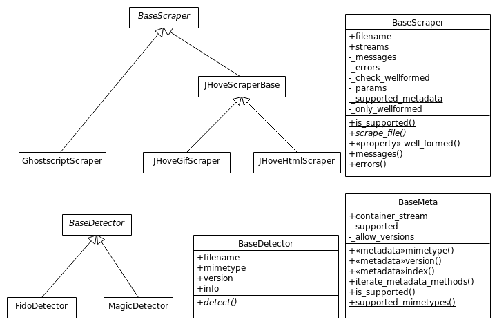
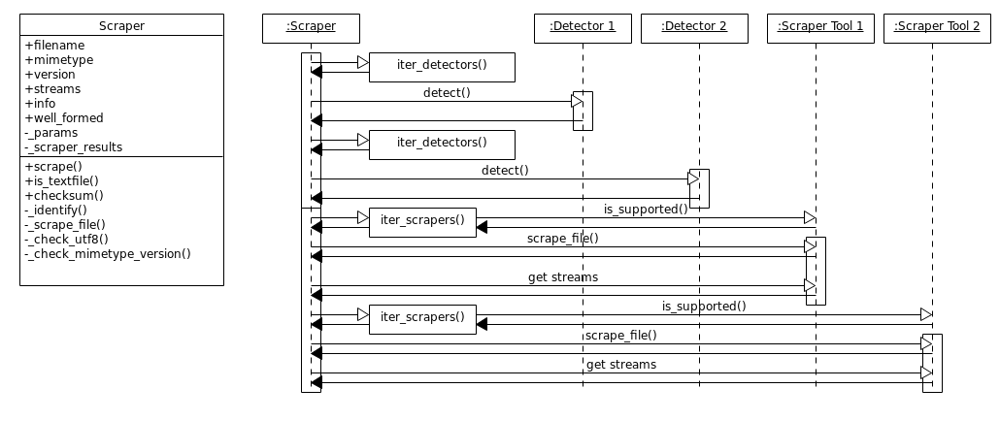

File Scraper Technical Notes
============================

Here are some notes about the technical functionality of the file-scraper tool.

Detectors
---------

The detectors are used for detecting the file mimetype and, if possible, format version. These values are used for selecting the correct extractors
for collecting metadata and checking well-formedness of the file. The detectors are located in ``./file_scraper/detectors.py``

The detectors inherit ``BaseDetector`` class, which contains an abstract method ``detect()``. A detector class:

    * MUST call ``super()`` during initialization, if separate initialization method is created.
    * SHOULD detect mimetype of selected file formats and store it in mimetype attribute when ``detect()`` is called.
    * MAY detect also format version and store it in version attribute.

The ``info`` attribute contains a dict of class name and scraper software as well as messages and errors occured during detection.
See ``<scraper info X>`` from `README.rst <../README.rst>`_ for the content of the info attribute.

Scraper tools
-------------

All the iterable and usable extractor tools are located in subdirectories of ``./file_scraper/`` directory. These extractor tools are based on ``BaseExtractor``,
either by directly inheriting it, or via inheriting a tool specific base class that inherits ``BaseExtractor``.

In the Figure above, ``GhostScriptExtractor`` inherits ``BaseExtractor`` directly, but ``JHoveGifExtractor`` and ``JHoveHtmlExtractor`` inherit it indirectly via ``JHoveExtractorBase`` base class, as do other subclasses of JHoveExtractorBase not shown in the Figure.
These extractor tools are located in ``./file_scraper/ghostscript/`` and ``./file_scraper/jhove/`` directories. When the used 3rd party tool is
file format specific, it can inherit ``BaseExtractor`` directly, but in some cases writing an intermediate subclass is a justified decision. For example as different JHOVE modules are able to handle a number of file types, including the mentioned GIF and HTML files among others, we need custom handling for different file types. This is why each module has its own extractor that inherits the ``JHoveBaseExtractor`` providing the core scraping function. In many cases a single extractor class supporting multiple metadata models for different file types can be sufficient though.

A usable extractor tool class:

    * MUST have ``_supported_metadata`` class variable which is a list of metadata classes supported by the extractor.
    * MUST have ``_only_wellformed = True`` class variable, if the extractor tools does just well-formed check.
    * MUST call ``super()`` during initialization, if separate initialization method is created.
    * MUST implement ``scrape_file()`` for file scraping, if not implemented in the already existing base class. This method:

        * MUST add metadata objects of all metadata models to ``streams`` list for each stream in the file. The MIME type and version given in params MUST be passed to the metadata object.
        * SHOULD call ``_validate()`` when the metadata has been collected. This checks that the final mimetype and version are supported ones, in case those have changed.
        * MUST log all errors (e.g. ""The file is truncated" or ""File not found.") to ``_errors`` list and messages (e.g. "File was analyzed with ``ExtractorName``") to ``_messages`` list.
    * The ``info()`` method of a extractor MUST return a dict of class name and used 3rd party software, and messages and errors occured during scraping. See ``<extractor info X>`` from `README.rst <../README.rst>`_ for the content of the info attribute.

The metadata is represented by metadata model objects, e.g. ``GhostscriptMeta`` used by ``GhostscriptExtractor``, and ``JHoveGifMeta``, ``JHoveHtmlMeta`` and others used by ``JHoveExtractor``. These metadata model classes:

    * MUST have _supported class variable as a dict, the keys of which are supported mimetypes and values are lists of supported file format versions.
    * Using the metadata model without prior knowledge of the version or with an unlisted version MAY be allowed by setting class variable ``_allow_any_version = True``.
    * MUST have a method for each metadata element that is scraped, if not implemented in the already existing base class.
        * These methods MUST be decorated with ``metadata``-function, and MUST normally return string, with exception of ``index()`` which returns stream index as integer.
        * The metadata methods MUST normalize the value to a normalized format. The formats described e.g. in AudioMD [1]_, VideoMD [1]_, and MIX [2]_ are used in normalization.
        * The key of the metadata element in ``streams`` will be the method name, and value is the return value of the method.
        * Metadata method MAY raise ``SkipElement`` from ``file_scraper.base``, if the methods needs to be omitted in collection phase. This may become handy with files containing different kinds of streams. Value ``(:unav)`` is returned when a extractor cannot determine the value of a metadata element and ``(:unap)`` when the metadata element is not applicable to the stream type.
        * Example of a metadata method::

            @BaseMeta.metadata
            def width(self):
                return self._width

    * MUST implement metadata method ``stream_type()``, returning e.g. "text", "image", "audio", "video", "videocontainer", "binary", if not implemented in the already existing base class.
    * MUST crash or log an error in unexpected event, such as due to missing 3rd party tool.
    * Metadata keys that are needed to win in the combination phase are flagged by ``important`` as part of metadata-decorator.
    * If custom MIME type scraping is implemented, user-supplied MIME type given to the initializer MUST be returned by ``mimetype()`` function if given.
    * If custom version scraping is implemented, user-supplied version must be returned by ``version()`` if both MIME type and version were given to the initializer. If MIME type or version was not given, the same version MUST be returned as would have been if neither had been given.

Should you create a new extractor tool for some file format, it probably already has a proper base class, for example:

    * ``PilExtractor`` and ``WandExtractor`` for images: You need to create a file format specific scraping tool for  both to create full metadata collection.
    * ``MediainfoExtractor`` and ``FFMpegExtractor`` for audio and video files: You can not use both for video container metadata scraping, since these tools return the streams in different order.
    * ``MagicExtractor`` for a variety of files, including text and markup (HTML, XML) files, some image formats, pdf and office files.
    * ``JHoveExtractor`` for various file formats: You may add a file format for JHove well-formed check, if applicable.
    * ``BaseExtractor`` is generic base class for extractors not suitable to use any of the previous ones for full scraping and for new tool specific base classes.

In practice, just add proper values to class variables, and write the ``scrape_file()`` method and metadata model class(es). The tool specific base classes already have ``scrape_file()`` method implemented. To maintain clarity, the new extractor classes and metadata models should be created into their tool-specific subdirectories under ``./file_scraper/``.

.. [1] https://www.loc.gov/standards/amdvmd/
.. [2] http://www.loc.gov/standards/mix/

Scraper sequence
----------------

The main scraper iterates all detectors to determine mimetype and possibly file format version. The results of the detectors are given to extractor iterator,
which forwards the values to ``is_supported()`` class method of the extractor. The ``is_supported()`` method makes the decision, whether its extractor is supported or not.
Supported extractors are iterated, and the result of each extractor is combined directly to the final result. The resulted attributes are listed in `README.rst <../README.rst>`_.

The main Scraper does everything in sequenced order. Should the extractor functionality be done in parallel, this can be changed by modifying the Extractor class
and the utility functions it uses.

Scraping without checking well-formedness
-----------------------------------------

    * Individual extractor tools return always ``True`` or ``False`` as ``well_formed``, regardless of the use of ``check_wellformed`` parameter in main Scraper.
      The main Scraper resolves ``well_formed`` as ``None``, if the tool's result was ``True`` and ``check_wellformed`` parameter is ``False``.
      This is because all required extractor tools are not used when ``check_wellformed`` is ``False``.
      The ``is_supported()`` method in the tools solves whether a tool shoud be run or not, but otherwise the tools do not know which method is used in the main Scraper.
    * Scraping without checking well-formedness must still somehow detect the mimetype and version, and it must give error in ``info()``
      if the detection does not comply with the given file type. Mainly for this reason, some file format versions detected by the detectors
      are provided to a dummy extractor, which result this value for the main Scraper.

          * Example: If ``text/plain`` is given, but ``text/html`` is resolved, then well_formed must be ``True`` (in the end ``None``).
          * Example: If ``image/jpeg`` is given, but ``text/plain`` is resolved, then well_formed must be ``False`` (in the end ``False``).

A Few Guidelines for Resulting MIME Type (and version)
------------------------------------------------------

    * If the validator supports only one particular file format, then the extractor can result the mimetype as a string, if there are no errors.
      Then it means that the file is compliant with the only supported (and originally predefined) format.
      If there are errors, then the validator does not really know the mimetype, and therefore ``(:unav)`` should be returned.
    * If we give a PNG file predefined as GIF file, then a GIF extractor produces errors and PNG+GIF extractor does not.
      The GIF extractor can not give the mimetype, since it gives errors, and therefore it does not know what the file is.
      The PNG+GIF extractor can give the mimetype ONLY if it is able to resolve the mimetype.
    * If we give an XML file as a Plain text file, then Plain text extractors are run.
      These should result either ``text/plain`` as mimetype, or ``(:unav)`` if they are not sure about it.
      For Plain text files this is actually possible only if the extractor is a plain text specific extractor and no errors are found.
    * If all the extractors result ``(:unav)`` as mimetype, then the actual file format is unknown.
      There must be at least one extractor which resolves the mimetype and version.
    * If the predefined mimetype differs from the resulted one, then it is the main Scraper's responsibility to resolve this with an extra error message.
    * The same applies also to file format version.

Test Data
---------

When new test data is added under ``tests/data``, it is automatically discovered by ``tests/end_to_end_test.py``. These tests determine the expected scraping result based on the file name and path, so in order for these tests to pass, the files must follow the naming ::

    tests/data/<mime_type>/<well_formedness>_<version>_<description>.<extension>

where

* ``mime_type`` is the MIME type of the file with slash replaced with underscore, e.g. ``image_jpeg``
* ``well_formedness`` is either ``valid`` or ``invalid`` depending on whether the file is well-formed
* ``version`` is the version of the file type, e.g. `1.01`
* Everything that comes after the underscore following the version number is technically optional but should still be included for clarity, and ``description`` can be used e.g. to specify other relevant information about the file (e.g. why it is not well-formed, or relevant information about non-filetype metadata)
* ``extension`` is also not used by the tests, but it should be included for human-readability

