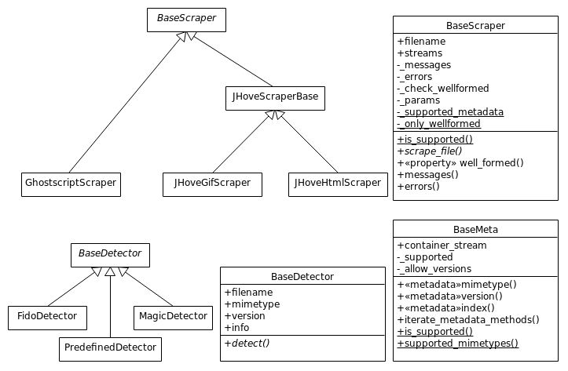

File Scraper Technical Notes
============================

Here are some notes about the technical functionality of the file-scraper tool.

Detectors
---------

The detectors are used for detecting the file mimetype and, if possible, format version. These values are used for selecting the correct scraper tools
for collecting metadata and checking well-formedness of the file. For now, there exists just two detectors, and both are located in ``./file_scraper/detectors.py``

The detectors inherit ``BaseDetector`` class, which contains an abstract method ``detect()``. A detector class:

    * MUST call ``super()`` during initialization, if separate initialization method is created.
    * MUST detect mimetype of selected file formats and store it in mimetype attribute when ``detect()`` is called.
    * MAY detect also format version and store it in version attribute.

The ``info`` attribute contains a dict of class name, and messages and errors occured during detection.
See ``<scraper info X>`` from `README.rst <../README.rst>`_ for the content of the info attribute.

Scraper tools
-------------

All the iterable and usable scraper tools are located in subdirectories of ``./file_scraper/`` directory. These scraper tools are based on ``BaseScraper``,
either by directly inheriting it, or via inheriting a tool specific base class that inherits ``BaseScraper``.

In the Figure above, ``GhostScriptScraper`` inherits ``BaseScraper`` directly, but ``JHoveGifScraper`` and ``JHoveHtmlScraper`` inherit it indirectly via ``JHoveScraperBase`` base class, as do other subclasses of JHoveScraperBase not shown in the Figure.
These scraper tools are located in ``./file_scraper/ghostscript/`` and ``./file_scraper/jhove/`` directories. When the used 3rd party tool is
file format specific, it can inherit ``BaseScraper`` directly, but in some cases writing an intermediate subclass is a justified decision. For example as different JHOVE modules are able to handle a number of file types, including the mentioned GIF and HTML files among others, we need custom handling for different file types. This is why each module has its own scraper that inherits the ``JHoveBaseScraper`` providing the core scraping function. In many cases a single scraper class supporting multiple metadata models for different file types can be sufficient though.

A usable scraper tool class:

    * MUST have ``_supported_metadata`` class variable which is a list of metadata classes supported by the scraper.
    * MUST have ``_only_wellformed = True`` class variable, if the scraper tools does just well-formed check.
    * MUST call ``super()`` during initialization, if separate initialization method is created.
    * MUST implement ``scrape_file()`` for file scraping, if not implemented in the already existing base class. This method:

        * MUST add metadata objects of all metadata models to ``streams`` list for each stream in the file.
        * SHOULD call ``_check_supported()`` when the metadata has been collected. This checks that the final mimetype and version are supported ones, in case those have changed.
        * MUST log all errors (e.g. ""The file is truncated" or ""File not found.") to ``_errors`` list and messages (e.g. "File was analyzed successfully" or "Skipping scraper") to ``_messages`` list.
    * The ``info()`` method of a scraper MUST return a dict of class name, and messages and errors occured during scraping. See ``<scraper info X>`` from `README.rst <../README.rst>`_ for the content of the info attribute.

The metadata is represented by metadata model objects, e.g. ``GhostscriptMeta`` used by ``GhostscriptScraper``, and ``JHoveGifMeta``, ``JHoveHtmlMeta`` and others used by ``JHoveScraper``. These metadata model classes:

    * MUST have _supported class variable as a dict, the keys of which are supported mimetypes and values are lists of supported file format versions.
    * Using the metadata model without prior knowledge of the version or with an unlisted version MAY be allowed by setting class variable ``_allow_versions = True``.
    * MUST have a method for each metadata element that is scraped, if not implemented in the already existing base class.
        * These methods MUST be decorated with ``metadata``-function, and MUST normally return string, with exception of ``index()`` which returns stream index as integer.
        * The metadata methods MUST normalize the value to a normalized format. The formats described e.g. in AudioMD [1]_, VideoMD [1]_, and MIX [2]_ are used in normalization.
        * The key of the metadata element in ``streams`` will be the method name, and value is the return value of the method.
        * Metadata method MAY raise ``SkipElement`` from ``file_scraper.base``, if the methods needs to be omitted in collection phase. This may become handy with files containing different kinds of streams. The value ``None`` is used for the case that the value SHOULD be returned, but the scraper tool is not capable of doing that. Value ``(:unav)`` is returned when a scraper cannot determine the value of a metadata element and ``(:unap)`` when the metadata element is not applicable to the stream type.
        * Example of a metadata method::
        
            @metadata
            def width(self):
                return self._width
                
    * MUST implement metadata method ``stream_type()``, returning e.g. "text", "image", "audio", "video", "videocontainer", "binary", if not implemented in the already existing base class.
    * MUST crash or log an error in unexpected event, such as due to missing 3rd party tool.
    * Metadata keys that are needed to win in the combination phase are flagged by ``important`` as part of metadata-decorator.

Should you create a new scraper tool for some file format, it probably already has a proper base class, for example:

    * ``PilScraper`` and ``WandScraper`` for images: You need to create a file format specific scraping tool for  both to create full metadata collection.
    * ``MediainfoScraper`` and ``FFMpegScraper`` for audio and video files: You can not use both for video container metadata scraping, since these tools return the streams in different order.
    * ``MagicScraper`` for a variety of files, including text and markup (HTML, XML) files, some image formats, pdf and office files.
    * ``JHoveScraper`` for various file formats: You may add a file format for JHove well-formed check, if applicable.
    * ``BaseScraper`` is generic base class for scrapers not suitable to use any of the previous ones for full scraping and for new tool specific base classes.

In practice, just add proper values to class variables, and write the ``scrape_file()`` method and metadata model class(es). The tool specific base classes already have ``scrape_file()`` method implemented. To maintain clarity, the new scraper classes and metadata models should be created into their tool-specific subdirectories under ``./file_scraper/``.

.. [1] https://www.loc.gov/standards/amdvmd/
.. [2] http://www.loc.gov/standards/mix/

Scraper sequence
----------------

The main scraper iterates all detectors to determine mimetype and possibly file format version. The results of the detectors are given to scraper iterator,
which forwards the values to ``is_supported()`` class method of the scraper. The ``is_supported()`` method makes the decision, whether its scraper is supported or not.
Supported scrapers are iterated, and the result of each scraper is combined directly to the final result. The resulted attributes are listed in `README.rst <../README.rst>`_.

The main Scraper does everything in sequenced order. Should the scraper functionality be done in parallel, this can be changed by modifying the Scraper class
and the utility functions it uses.

.. image:: scraper_seq.png
